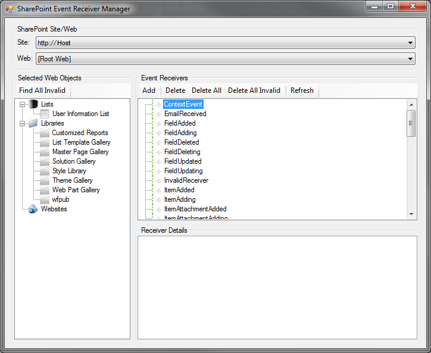
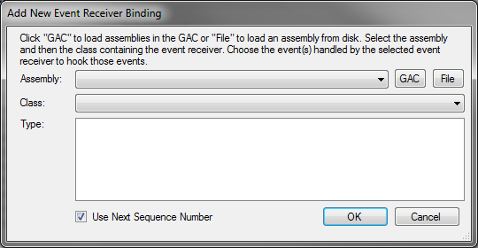

# SharePoint Event Receiver Manager (2007 & 2010)
 
## Project Description
The SharePoint Event Receiver Manager tool draws upon the needs I've had as a SharePoint developer and the ideas of several other tools that just covered part of what I needed them to do but just didn't go quite far enough to make the easy to use and painless. Written in C#.

## Features
* Auto detection of local SharePoint instances
* Validation for existing event hooks
* Ability to view and modify event receiver definition properties including sequence number
* Select from assemblies already in GAC when adding a new event receiver hook
* Select an assembly file which will be automatically registered in GAC when adding a new event receiver hook
* Automatic validation on Add to ensure selected assemblies contain event receiver definitions
* Automatic filtering of event hooks to show only those events hooks defined in a selected event receiver

## Main Form:

## Add Dialog:

